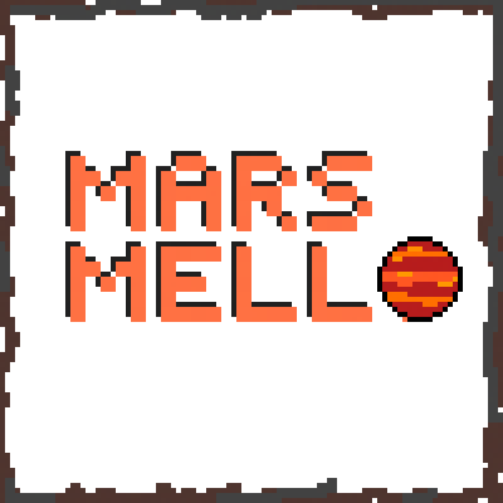

# MarsMello

  

## The Game Plot

MarsMello is a truly decentralised Web3 game whose plot is based on colonising and industrialising Mars!
MarsMello can be described as an **Idle-Open World-Strategy-Economy-Simulation Game!**

* Players can buy plots of land (NFTs) in the game and setup factories (NFTs) and large industries on it.
* Factories will produce **ERC20** resources which the players can claim and trade for other **ERC20** tokens or **ETH** on **UniSwap**.
* Players must adopt strategies to maximise the profits as the Ore distribution and Factory efficiency will be randomised
(Because Life is Unfair)
* An In-Game Marketplace will enable users to trade and profit from the NFTs.
Given all the features and an open economy, it will be very lucrative to get hands on the game and start earning! 
This would bring in the attention to blockchain in the most simplest gamified form possible.

## Game Mechanics

1. The game is played by buying Land and placing Factories upon it. These factories have a pseudo-random efficiency rate and the land has a random generation of ores. Which implies that the yield rate will be different for each pair of land and factory.
1. After 24 hours the temporary storage fills up and no further yield can be accumulated. Player has to claim the resources to empty the storage.
1. Each land purchase gives the user a land with a random seed with the ore distribution. RNG was also a challenge we had to tackle.
1. The game mechanics are so complex that a single smart contract could not be used. We had to use **seven** separate smart contracts instead. 

    

    1. One  for the backbone token (called MLO) of the economy.
    1. One for each of the ERC20 tokens which are fungible in-game resources
    1. And one for handling all the in-game transactions and game-logic.

    

    
1. After the user claims the resources they can trade them on **UNISWAP** or any similar **ERC20 DEX** for MLO or ETH or any other in-game ERC20 token.

## Tech Behind It

### On the Blockchain

1. **Game Smart Contract**
1. **The Graph**
1. **Other Smart Contracts**

### Front End

1. **World**
1. **Data**
1. **Wallets**
3. **Optimisations**

